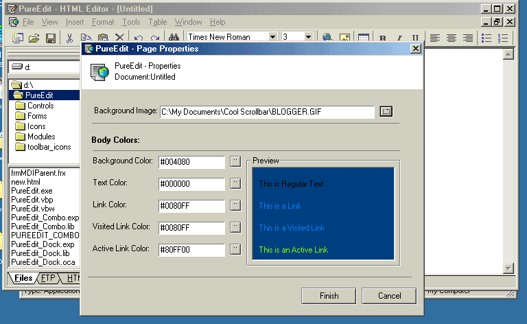



## PureEdit  4 \- HTML Editor

### Description

PureEdit is a WYSIWYG HTML Editor, it is not yet completed but is working now! Some features include Docking Windows, Office XP style Toolbars Excel Style tab control, Syntax Hilighting and more. Most application simler to PureEdit use 15+ mb of Ram, but PureEdit only uses about 8, with 1 file open! Not sure if PSC is still deleting ocx's but if they are you can dl it form my website: http://www16.brinkster.com/sailgreg//PureEdit.zip

Although this is Version 4 PureEdit started out as a cheep text editor and then it got petty good but I wanted a HTML Editor so I remade it but left it a Version 4. I have started remaking it in Delphi so I am not sure I will finish it in VB, but if I do I will post it on this site. If I finish it in Delphi, I will still post it on this site.
 
### More Info
 

             |
---                |---
**Submitted On**   |2001-12-07 17:43:00
**By**             |[sailgreg](https://github.com/Planet-Source-Code/PSCIndex/blob/master/ByAuthor/sailgreg.md)
**Level**          |Intermediate
**User Rating**    |4.0 (32 globes from 8 users)
**Compatibility**  |VB 6\.0
**Category**       |[Complete Applications](https://github.com/Planet-Source-Code/PSCIndex/blob/master/ByCategory/complete-applications__1-27.md)
**World**          |[Visual Basic](https://github.com/Planet-Source-Code/PSCIndex/blob/master/ByWorld/visual-basic.md)
**Archive File**   |[PureEdit\_\_402001272001\.zip](https://github.com/Planet-Source-Code/sailgreg-pureedit-4-html-editor__1-29572/archive/master.zip)

